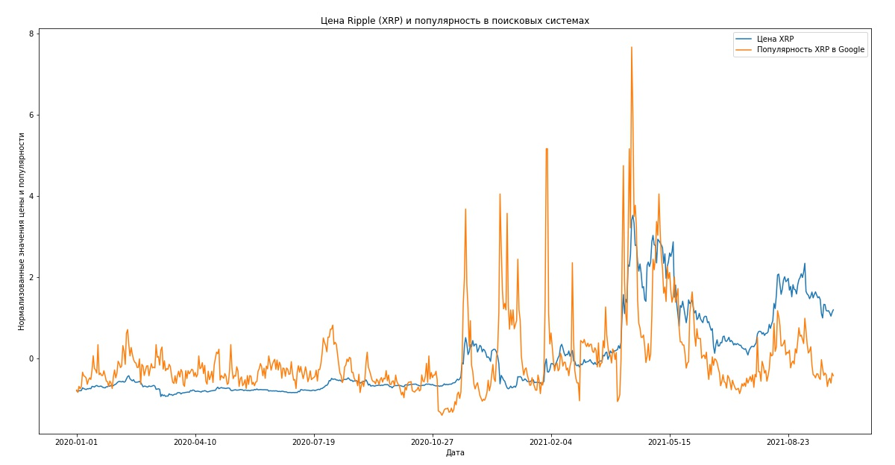
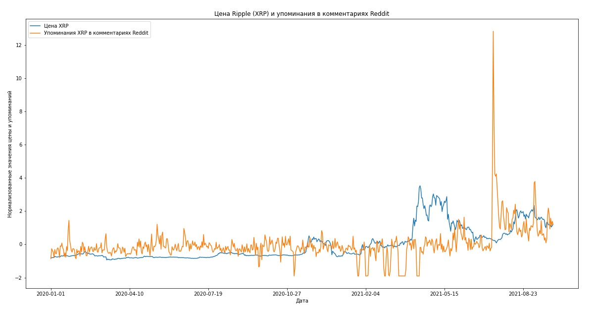

# Исторические данные о цене криптовалют и их упоминаниях в социальных сетях
## Команда «Commando»
Состав: Протасов Егор, Ершов Иван, Шишканов Георгий, Катюшин Илья, Барков Вячеслав, Смирнов Александр, Недоливко Алексей

## Описание датасета
В датасете содержится информация об исторических курсах криптовалют, их упоминаниях в социальных сетях, их популярности в поисковых системах. Данные в датасете представлены в виде файла .csv.
Датасет может быть использован для анализа рынка криптовалют, включая построение финансовых моделей, принятие долгосрочных и краткосрочных инвестиционных решений, анализ зависимостей пар криптовалют, корелляция популярности валюты с ее курсом. Датасет актуален на настоящее время, содержит большой объем данных и множество дополнительных характеристик.

## Источники
В датасете используются следующие источники:
* [Binance API](https://binance-docs.github.io/apidocs/spot/en/#change-log)
* [Coinmarketcap API](https://coinmarketcap.com/api/)
* [Pushshift Reddit API](https://github.com/pushshift/api)
* [Google Trends](https://trends.google.ru/api)

## Методы сбора и обработки
В качестве основы датасета были взяты данные, полученные при использовании Coinmarketcap API. Собраны данные за последние несколько лет по семи криптовалютам с наибольшей капитализацией на момент сбора данных, а именно:  Bitcoin, Ethereum, Binance Coin, Cardano, Tether, XRP, Solana. Данные включают в себя цену закрытия в рублях, долларах и относительно Bitcoin, как самой крупной криптовалюты. Также включены объем торгов и объем капитализации. Собраны данные о количествах упоминаний валют в комментариях Reddit используя Pushshift Reddit API. Также включен коэффициент популярности в Google Trends масштабированный на весь рассматриваемый в датасете период. Данные собраны и объединены в единый датасет.

## Структура датасета
Датасет находится в репозитории Github и называется final_2018-01-01_2021-09-30.csv.\
[Ссылка на файл в репозитории](data/result/final_2018-01-01_2021-09-30.csv)

|№| **Название** | **Описание** | **Тип** |
| ------ | ------ | ------ | ------ | 
| 1 | **date** | Дата торгов | datetime |
| 2 | **XRP_price_USD** | Цена Ripple к закрытию торгов в долларах США | float |
| 3 | **XRP_volume_USD** | Объем торгов Ripple в долларах США | float |
| 4 | **XRP_market_cap_USD** | Капитализация Ripple в долларах США | float |
| 5 | **XRP_price_RUB** | Цена Ripple к закрытию торгов в рублях | float |
| 6 | **XRP_volume_RUB** | Объем торгов Ripple в рублях | float |
| 7 | **XRP_market_cap_RUB** | Капитализация Ripple в рублях | float |
| 8 | **XRP_price_BTC** | Цена Ripple к закрытию торгов в Bitcoin | float |
| 9 | **XRP_volume_BTC** | Объем торгов Ripple в Bitcoin | float |
| 10 | **XRP_market_cap_BTC** | Капитализация Ripple в Bitcoin | float |
| 11 | **XRP_reddit_mentions** | Количество упоминаний Ripple в комментариях на Reddit | int |
| 12 | **XRP_google_trends** | Популярность Ripple в Google Trends | float |
| 13 | **SOL_price_USD** | Цена Solana к закрытию торгов в долларах США | float |
| 14 | **SOL_volume_USD** | Объем торгов Solana в долларах США | float |
| 15 | **SOL_market_cap_USD** | Капитализация Solana в долларах США | float |
| 16 | **SOL_price_RUB** | Цена Solana к закрытию торгов в рублях | float |
| 17 | **SOL_volume_RUB** | Объем торгов Solana в рублях | float |
| 18 | **SOL_market_cap_RUB** | Капитализация Solana в рублях | float |
| 19 | **SOL_price_BTC** | Цена Solana к закрытию торгов в Bitcoin | float |
| 20 | **SOL_volume_BTC** | Объем торгов Solana в Bitcoin | float |
| 21 | **SOL_market_cap_BTC** | Капитализация Solana в Bitcoin | float |
| 22 | **SOL_reddit_mentions** | Количество упоминаний Solana в комментариях на Reddit | int |
| 23 | **SOL_google_trends** | Популярность Solana в Google Trends | float |
| 24 | **BNB_price_USD** | Цена Binance Coin к закрытию торгов в долларах США | float |
| 25 | **BNB_volume_USD** | Объем торгов Binance Coin в долларах США | float |
| 26 | **BNB_market_cap_USD** | Капитализация Binance Coin в долларах США | float |
| 27 | **BNB_price_RUB** | Цена Binance Coin к закрытию торгов в рублях | float |
| 28 | **BNB_volume_RUB** | Объем торгов Binance Coin в рублях | float |
| 29 | **BNB_market_cap_RUB** | Капитализация Binance Coin в рублях | float |
| 30 | **BNB_price_BTC** | Цена Binance Coin к закрытию торгов в Bitcoin | float |
| 31 | **BNB_volume_BTC** | Объем торгов Binance Coin в Bitcoin | float |
| 32 | **BNB_market_cap_BTC** | Капитализация Binance Coin в Bitcoin | float |
| 33 | **BNB_reddit_mentions** | Количество упоминаний Binance Coin в комментариях на Reddit | int |
| 34 | **BNB_google_trends** | Популярность Binance Coin в Google Trends | float |
| 35 | **ADA_price_USD** | Цена Cardano к закрытию торгов в долларах США | float |
| 36 | **ADA_volume_USD** | Объем торгов Cardano в долларах США | float |
| 37 | **ADA_market_cap_USD** | Капитализация Cardano в долларах США | float |
| 38 | **ADA_price_RUB** | Цена Cardano к закрытию торгов в рублях | float |
| 39 | **ADA_volume_RUB** | Объем торгов Cardano в рублях | float |
| 40 | **ADA_market_cap_RUB** | Капитализация Cardano в рублях | float |
| 41 | **ADA_price_BTC** | Цена Cardano к закрытию торгов в Bitcoin | float |
| 42 | **ADA_volume_BTC** | Объем торгов Cardano в Bitcoin | float |
| 43 | **ADA_market_cap_BTC** | Капитализация Cardano в Bitcoin | float |
| 44 | **ADA_reddit_mentions** | Количество упоминаний Cardano в комментариях на Reddit | int |
| 45 | **ADA_google_trends** | Популярность Cardano в Google Trends | float |
| 46 | **ETH_price_USD** | Цена Ethereum к закрытию торгов в долларах США | float |
| 47 | **ETH_volume_USD** | Объем торгов Ethereum в долларах США | float |
| 48 | **ETH_market_cap_USD** | Капитализация Ethereum в долларах США | float |
| 49 | **ETH_price_RUB** | Цена Ethereum к закрытию торгов в рублях | float |
| 50 | **ETH_volume_RUB** | Объем торгов Ethereum в рублях | float |
| 51 | **ETH_market_cap_RUB** | Капитализация Ethereum в рублях | float |
| 52 | **ETH_price_BTC** | Цена Ethereum к закрытию торгов в Bitcoin | float |
| 53 | **ETH_volume_BTC** | Объем торгов Ethereum в Bitcoin | float |
| 54 | **ETH_market_cap_BTC** | Капитализация Ethereum в Bitcoin | float |
| 55 | **ETH_reddit_mentions** | Количество упоминаний Ethereum в комментариях на Reddit | int |
| 56 | **ETH_google_trends** | Популярность Ethereum в Google Trends | float |
| 57 | **BTC_price_USD** | Цена Bitcoin к закрытию торгов в долларах США | float |
| 58 | **BTC_volume_USD** | Объем торгов Bitcoin в долларах США | float |
| 59 | **BTC_market_cap_USD** | Капитализация Bitcoin в долларах США | float |
| 60 | **BTC_price_RUB** | Цена Bitcoin к закрытию торгов в рублях | float |
| 61 | **BTC_volume_RUB** | Объем торгов Bitcoin в рублях | float |
| 62 | **BTC_market_cap_RUB** | Капитализация Bitcoin в рублях | float |
| 63 | **BTC_price_BTC** | Цена Bitcoin к закрытию торгов в Bitcoin | float |
| 64 | **BTC_volume_BTC** | Объем торгов Bitcoin в Bitcoin | float |
| 65 | **BTC_market_cap_BTC** | Капитализация Bitcoin в Bitcoin | float |
| 66 | **BTC_reddit_mentions** | Количество упоминаний Bitcoin в комментариях на Reddit | int |
| 67 | **BTC_google_trends** | Популярность Bitcoin в Google Trends | float |
| 68 | **USDT_price_USD** | Цена Tether к закрытию торгов в долларах США | float |
| 69 | **USDT_volume_USD** | Объем торгов Tether в долларах США | float |
| 70 | **USDT_market_cap_USD** | Капитализация Tether в долларах США | float |
| 71 | **USDT_price_RUB** | Цена Tether к закрытию торгов в рублях | float |
| 72 | **USDT_volume_RUB** | Объем торгов Tether в рублях | float |
| 73 | **USDT_market_cap_RUB** | Капитализация Tether в рублях | float |
| 74 | **USDT_price_BTC** | Цена Tether к закрытию торгов в Bitcoin | float |
| 75 | **USDT_volume_BTC** | Объем торгов Tether в Bitcoin | float |
| 76 | **USDT_market_cap_BTC** | Капитализация Tether в Bitcoin | float |
| 77 | **USDT_reddit_mentions** | Количество упоминаний Tether в комментариях на Reddit | int |
| 78 | **USDT_google_trends** | Популярность Tether в Google Trends | float |

## Визуализация полученных данных
Для демонстрации полученного датасета и его актуальности и полезности, рассмотрим несколько графиков.

Данный график позволяет увидеть рост цены Ripple, следующий за ростом популярности Ripple в Google Trends.\

На данном графике можно отметить резкий скачок упоминаний Ripple в комментариях Reddit, после которого следует постепенный рост цены данной криптовалюты.